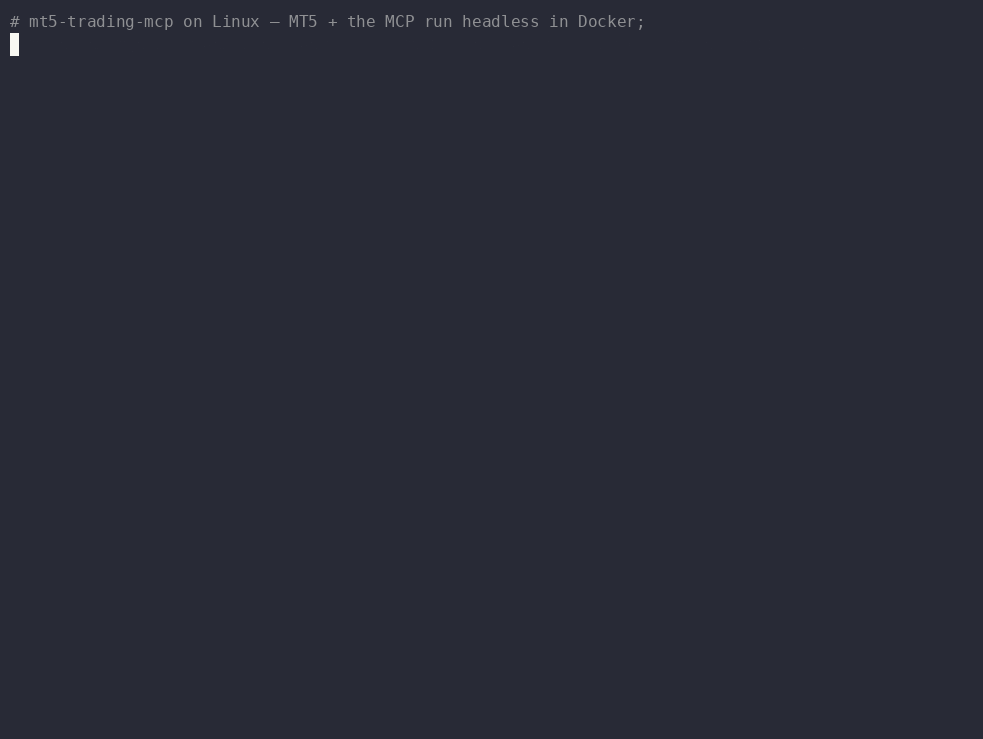
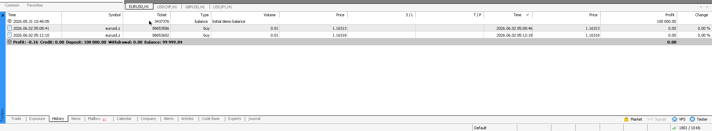

# mt5-mcp

[](https://pypi.org/project/mt5-trading-mcp/)
[](https://pypi.org/project/mt5-trading-mcp/)
[](LICENSE)
[](https://github.com/vincentwongso/mt5-trading-mcp/actions/workflows/test.yml)

Model Context Protocol server wrapping the MetaTrader 5 Python library: exposes
a logged-in MT5 terminal as a set of MCP tools an AI agent can call.

<p align="center">
  <br>
  <sub>A <a href="https://github.com/NousResearch">Hermes</a> agent placing then closing a real 0.01-lot trade on a <b>demo</b> account, end-to-end over MCP on Linux.</sub>
</p>

<p align="center">
  <br>
  <sub>Not a mock-up — the same round-trip in MetaTrader 5's own History tab; the tickets and balance match the recording.</sub>
</p>

> ⚠️ **This software places _real_ trades through your MetaTrader 5 terminal with
> real orders and irreversible fills.** Read [DISCLAIMER.md](DISCLAIMER.md)
> and [SECURITY.md](SECURITY.md) before connecting it to a live account. Always test
> using your demo account first.

Windows (native) or Linux (via Docker); Python 3.10+.

## What it is

`mt5-mcp` lets an AI agent read your MetaTrader 5 account and place trades
through it, over the Model Context Protocol. It runs locally, in the same
process tree as your agent, no cloud, no telemetry.

- **11 read-only tools**: account, quotes, positions, orders, history, OHLC
  bars, and broker-authoritative margin estimates. No consent gate.
- **4 mutating tools**: `place_order`, `modify_order`, `cancel_order`,
  `close_position`, each behind a preflight + human-consent + idempotency +
  audit layer.
- **3 subscribable resources**: live `account://`, `positions://`, and
  `quotes://{symbol}` snapshots that push change notifications.

Full catalogue and the consent flow: **[docs/tools.md](docs/tools.md)**.

## Quickstart (Windows, native)

```bash
pip install mt5-trading-mcp
```

1. Launch MetaTrader 5 and log into your broker. Enable **AlgoTrading** (toolbar
   button green).
2. Verify the terminal is reachable: `python -m mt5_mcp doctor`: expect
   `[INFO] backend: native` and `[PASS]` lines.
3. Run it: `python -m mt5_mcp serve`.

**Linux** (the MT5 terminal runs in an all-in-one Docker image; the agent talks
MCP over HTTP) and **wiring to an agent** are in
**[docs/installation.md](docs/installation.md)**.

## For AI agents

**If you've been handed this repository to install and run, follow the runbook
in [docs/agents.md](docs/agents.md).** It covers platform detection, install,
verification, registering the server, and the hard safety rules for trades —
read it before calling any mutating tool.

## Documentation

| Guide | What's in it |
|---|---|
| [Installation & setup](docs/installation.md) | Requirements, Windows + Linux/Docker setup, wiring to an agent. |
| [For AI agents](docs/agents.md) | Step-by-step runbook for an agent installing and running the server. |
| [Configuration](docs/configuration.md) | `config.toml` schema, storage paths, hot-reload. |
| [Tools & resources](docs/tools.md) | Read tools, mutating tools + consent flow, subscribable resources. |
| [MCP client setup](docs/clients.md) | Per-client config snippets and Claude Code usage. |
| [Transports & deployment](docs/deployment.md) | stdio/HTTP transports and Windows VPS patterns. |
| [Contributing](CONTRIBUTING.md) | How to contribute and run the tests. |
| [Changelog](CHANGELOG.md) | Release history and known limitations. |

## Safety

`mt5-mcp` is **not** the security boundary, the broker's MT5 server enforces
the hard limits (margin, max-lot, symbol permissions). Pre-flight checks in the
policy engine are UX guardrails to catch agent mistakes early, not security
controls.

Mutating actions above the configured `auto_approve_notional` (or that widen
stops) require explicit human approval via the `ApprovalPreview` flow. Every
mutating call is recorded in an append-only audit JSONL log. For vulnerability
disclosure, see [SECURITY.md](SECURITY.md).

## Architecture

`mt5-mcp` wraps the MetaTrader 5 Python library behind a FastMCP server. A single `MT5Client` (`src/mt5_mcp/adapter/`) owns the terminal connection, broker-timezone inference, and type conversions; everything else sits on top of it. The Pydantic models in `src/mt5_mcp/types.py` / `src/mt5_mcp/config.py` are the source of truth for the data and config schemas.

```
     Agent / MCP client  (Hermes, OpenClaw, Claude Code, Claude Desktop, …)
                               │
                               │   stdio  ·  loopback HTTP
                               ▼
 ┌──────────────────────────────────────────────────────────┐
 │                      FastMCP server                      │
 │                                                          │
 │   tools/        resources/        policy/                │
 │   read +        subscribable      consent · idempotency  │
 │   mutating      account/quotes    · audit (JSONL)        │
 │                                                          │
 │   streaming/  — change-detection poller + dispatcher     │
 │   types.py · config.py — Pydantic schemas: source of     │
 │                          truth for data + config         │
 │                                                          │
 └──────────────────────────────────────────────────────────┘
                               │
                               ▼
 ┌──────────────────────────────────────────────────────────┐
 │                                                          │
 │   adapter/  MT5Client                                    │
 │   one terminal connection · broker-TZ inference ·        │
 │   type conversions · transparent reinit                  │
 │                                                          │
 └──────────────────────────────────────────────────────────┘
                               │
                               ▼
MetaTrader 5 Python library  →  broker terminal  →  broker server
```

The module paths shown (`tools/`, `resources/`, `policy/`, `streaming/`,
`adapter/`, `types.py`, `config.py`) all live under `src/mt5_mcp/`.

## Contributing

Contributions are welcome, see [CONTRIBUTING.md](CONTRIBUTING.md) for the dev
setup, test workflow, and project principles.

## License

MIT - see [`LICENSE`](LICENSE).
